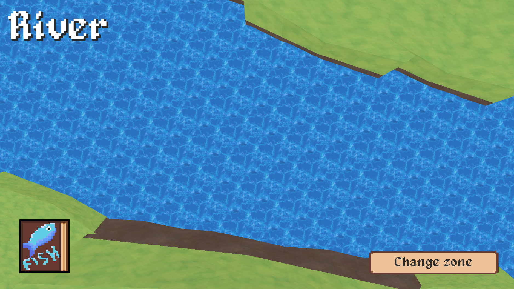
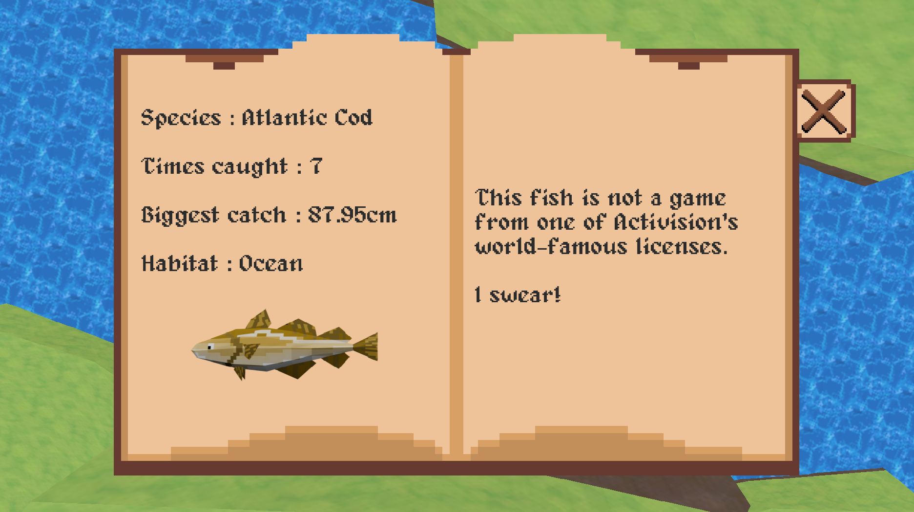
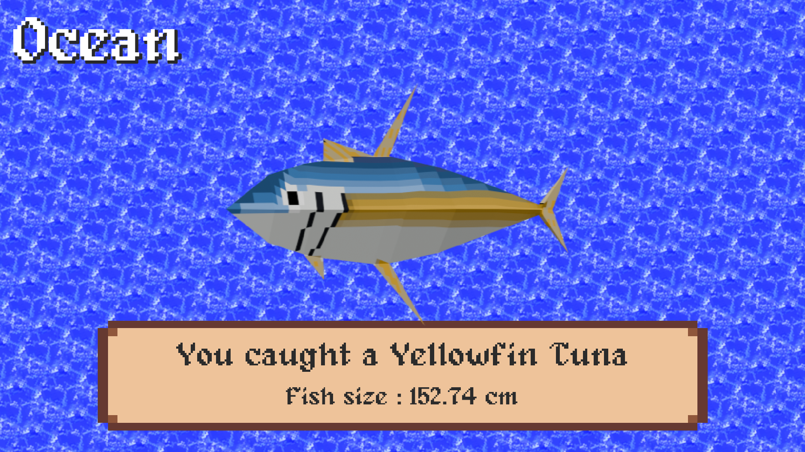

# Fish — The Side-Quest Game

A small fishing game built with **Godot 4**.

The project started as a simple fishing game and grew around a collection/achievement loop: catch fish, record them in an encyclopedia, improve records, and unlock achievements.

> **Project status:** On hold  
> **Engine:** Godot 4.3  
> **Platforms:** Android and Web



## Gameplay

The core loop is intentionally simple:

- Fish in different environments.
- Catch and record fish.
- Track catch counts and size records.
- Complete the fish encyclopedia.
- Unlock achievements.
- Keep player progress between sessions.

The game stores static fish and achievement definitions in JSON and saves player progress locally.

## Screenshots





## Technical highlights

- Godot 4.3
- GDScript
- 3D scenes with a compatibility renderer
- JSON-based game data
- Local save system using `user://`
- Achievement system
- Fish encyclopedia / collection system
- Android export
- Web export

The main scene is `Scenes/game.tscn`. Global game state and persistence are handled through an autoload script.

## Project structure

```text
.
├── Scenes/              # Game and UI scenes
├── Scripts/             # Gameplay and systems
├── Textures/            # Visual assets
├── Audio/               # Audio assets
├── fish_data.json       # Static fish information
├── achievements_data.json
├── project.godot
└── export_presets.cfg
```

## Running the project

1. Install **Godot 4.3** or a compatible Godot 4 version.
2. Clone this repository.
3. Open the project in Godot.
4. Run the main scene / project.

The configured main scene is:

```text
res://Scenes/game.tscn
```

## Export

The project currently contains export presets for:

- Android
- Web

Android uses the package identifier:

```text
com.tiruu.fish
```

Export paths stored in the Godot preset are local development paths and may need to be changed on another machine.

## Persistence

Player progression is saved locally:

```text
user://fish_save_data.json
user://achievements_save_data.json
```

Static content is loaded from:

```text
res://fish_data.json
res://achievements_data.json
```

This separation keeps game content independent from the player's save data.

## What I worked on

This project was primarily an exercise in building a complete small game rather than just a prototype:

- gameplay logic
- data-driven fish and achievement systems
- persistent progression
- UI and collection screens
- mobile-oriented input
- Web and Android exports
- iterative balancing and content additions

## Links

- [Play / project page on itch.io](https://tiruuslow.itch.io/fish)

## Current direction

The project is currently on hold while I focus on smaller, more focused projects.

The code remains available as a development reference and as an example of my Godot / GDScript work.
